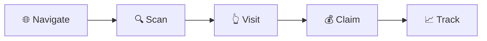

<div align="center">


# AliExpress Coupon Claimer

**Automatically scan your AliExpress orders and claim £1 late delivery coupons**

[](https://www.gnu.org/licenses/gpl-3.0)
[](https://github.com/evenwebb/AliClaimer)
[](https://github.com/evenwebb/AliClaimer/releases)

[Installation](#installation) • [Features](#features) • [Usage](#usage) • [Support](#support)

</div>

---

## ✨ Features

<table>
<tr>
<td width="50%">

### 🤖 Automatic Scanning
Visits each order and checks for late delivery coupons automatically

</td>
<td width="50%">

### 🎯 One-Click Claiming
Automatically clicks "Collect" when coupons are found

</td>
</tr>
<tr>
<td width="50%">

### 🔍 Smart Filtering
Only scans "Processed" (delivered) orders to save time

</td>
<td width="50%">

### 📊 Progress Tracking
Real-time stats showing orders checked and coupons claimed

</td>
</tr>
<tr>
<td width="50%">

### 👁️ Preview Mode
Scan orders to see which have coupons without claiming them

</td>
<td width="50%">

### 🔒 Safe & Secure
No data collection, works entirely in your browser

</td>
</tr>
</table>

---

## 📖 How It Works

When an order isn't delivered within 7 days, AliExpress may offer a **£1 coupon** as compensation. Normally, you have to manually check each order page and click "Collect". This extension automates that process:



1. **🌐 Navigate** - Automatically clicks the "Processed" tab to show only delivered orders
2. **🔍 Scan** - Collects all order links from the page
3. **👆 Visit** - Opens each order detail page in sequence
4. **💰 Claim** - Clicks the "Collect" button when a late delivery coupon is found
5. **📈 Track** - Displays real-time statistics of progress

---

## 🚀 Installation

### From Source (Developer Mode)

1. **Download** or clone this repository
   ```bash
   git clone https://github.com/evenwebb/AliClaimer.git
   ```

2. **Open Chrome Extensions**
   - Navigate to `chrome://extensions/`
   - Enable **Developer mode** (toggle in top right corner)

3. **Load the Extension**
   - Click **Load unpacked**
   - Select the `AliClaimer` folder

4. **Done!** The extension icon should now appear in your browser toolbar

---

## 💡 Usage

### Basic Usage

<table>
<tr><td>

**Step 1** - Navigate to Orders
```
🌐 Go to: https://www.aliexpress.com/p/order/index.html
```

</td></tr>
<tr><td>

**Step 2** - Start the Extension
```
🔌 Click the AliClaimer icon in your toolbar
```

</td></tr>
<tr><td>

**Step 3** - Claim Coupons
```
▶️ Click "Start Claiming Coupons"
```

</td></tr>
<tr><td>

**Step 4** - Monitor Progress
```
📊 Watch the stats update in real-time
```

</td></tr>
</table>

### Preview Mode

> **💡 Tip:** Want to see which orders have coupons without claiming them?

1. ✅ Check the **Preview mode** checkbox before clicking Start
2. 🔍 The extension will scan orders and show which ones have coupons available
3. 🚫 No coupons will be claimed - perfect for checking before you claim

### Tips & Tricks

- 🔄 **No manual scrolling needed** - The extension automatically loads more orders as it scans
- ⏸️ **Can resume** - Stop and restart anytime; it will continue from the order list
- ⚡ **Safe to use** - Processes one order at a time to avoid rate limits
- 🌐 **Works in background** - You can minimize the browser while it runs

---

## 🔍 What It Looks For

The extension searches for **"Collect"** buttons inside `.item-action` elements - specifically the ones that appear with the message:

> *"Sorry for the late delivery. As compensation here's a £1.00 coupon code."*

---

## 🔐 Privacy & Security

<div align="center">

| Feature | Status |
|---------|--------|
| 🚫 No data collection | ✅ All processing happens locally |
| 🌐 No external servers | ✅ Extension doesn't send data anywhere |
| 👁️ No tracking | ✅ Your orders and activities remain private |
| 📖 Open source | ✅ Full code available for review |
| 🔒 Minimal permissions | ✅ Only requests necessary permissions |

</div>

### Permissions Explained

This extension requires the following permissions:

- **`activeTab`** - To interact with the current AliExpress tab
- **`scripting`** - To run scripts on AliExpress pages
- **`storage`** - To save progress and statistics locally
- **`tabs`** - To navigate between order pages
- **`host_permissions (aliexpress.com)`** - To access AliExpress order pages

---

## 🛠️ Development

### Project Structure

```
AliClaimer/
├── 📄 manifest.json              # Extension configuration
├── ⚙️ background.js              # Background service worker
├── 🎨 popup.html                 # Extension popup UI
├── 📜 popup.js                   # Popup logic
├── 📋 content-order-list.js      # Script for order list page
├── 📝 content-order-detail.js    # Script for order detail page
├── 🖼️ images/                    # Icons and logo
│   ├── icon16.png
│   ├── icon48.png
│   ├── icon128.png
│   └── aliclaimerlogo.png
├── 📖 README.md                  # This file
└── 📜 LICENSE                    # GPL-3.0 License

```

### Contributing

Contributions are welcome! Please see [CONTRIBUTING.md](CONTRIBUTING.md) for guidelines.

### Building for Production

The extension is ready to use as-is. To package for distribution:

1. Ensure all files are in a single directory
2. Zip the directory (exclude `.git` if present)
3. Upload to Chrome Web Store or share the zip file

---

## ⚠️ Known Limitations

- ⚠️ Only works on AliExpress order pages
- 🔐 Requires manual login to AliExpress
- 🐌 Processes orders sequentially (by design, to avoid rate limits)
- 🏗️ Depends on AliExpress page structure (may break if they redesign)

---

## 🐛 Troubleshooting

<details>
<summary><b>Extension not starting?</b></summary>

- ✅ Make sure you're on the AliExpress orders page
- 🔄 Try refreshing the page
- 🔐 Check that you're logged in to AliExpress

</details>

<details>
<summary><b>No orders found?</b></summary>

- ⏳ The page may still be loading - wait a few seconds and try again
- 📦 Make sure you have orders in the "Processed" tab
- 📜 Try scrolling down to load more orders before starting

</details>

<details>
<summary><b>Extension stopped working?</b></summary>

- 🏗️ AliExpress may have changed their page structure
- 🔄 Check for updates to this extension
- 🐛 Open an issue on GitHub with details

</details>

---

## 📜 License

This project is licensed under the **GPL-3.0 License** - see the [LICENSE](LICENSE) file for details.

```
Copyright (C) 2025 evenwebb (https://github.com/evenwebb)
```

---

## ⚠️ Disclaimer

> This extension is **not affiliated with, endorsed by, or sponsored by AliExpress**. Use at your own risk. The extension automates manual tasks that you could perform yourself - it doesn't exploit any vulnerabilities or bypass security measures.

---

## 💬 Support

<div align="center">

**Found a bug or have a feature request?**

[](https://github.com/evenwebb/AliClaimer/issues)

[Open an Issue](https://github.com/evenwebb/AliClaimer/issues) • [View Documentation](https://github.com/evenwebb/AliClaimer)

---

**Made with ❤️ by [evenwebb](https://github.com/evenwebb)**

⭐ Star this repo if you find it useful!

</div>
